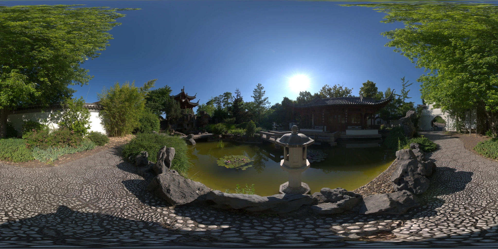
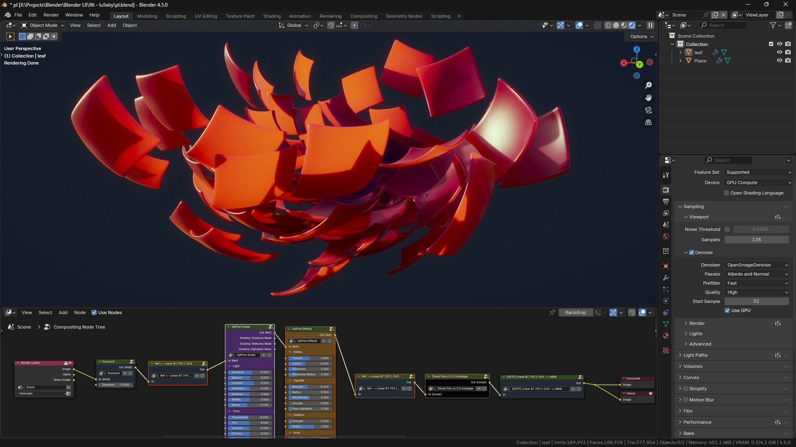
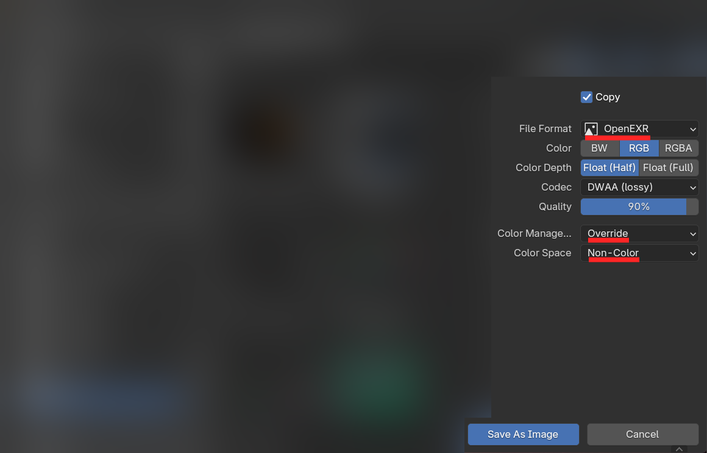
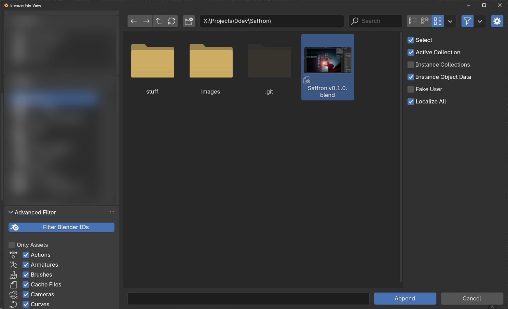

# 🪻 Saffron

**Saffron** is a large collection of compositor nodes for [Blender](https://blender.org/) providing many great features in the following categories:
- ### Color Grading & Effects
- ### Black & White
- ### Masking
- ### Advanced Color Processing
- ### Color Space Conversions: Linear, Displays, ACES, Oklab.
- ### View Transforms: [flim](https://github.com/bean-mhm/flim), Khronos PBR Neutral, ACES, and more.

Here's some eye candy to show you how Saffron can transform images. Whether you
want a vintage look with film emulation or cinematic color grading, Saffron's
got you covered!

### 1. Processing linear OpenEXR images with Saffron

### 2.

### 3.

### 4.

### 5. Saffron running in the 3D viewport using Blender's Realtime Compositor

# Color Grading & Effects

This section is the go-to for general photo editing. Let's see what each node
does.

## Camera Noise Reduction

This node uses Blender's built-in Denoise node at the high quality preset but when mixing, it gives more weight to darker pixels since, in digital cameras, darker pixels contain a lot more noise than the midtones, and highlights are usually very clean.

## Saffron Grade

This node is all about color grading. It uses the [Oklab](https://bottosson.github.io/posts/oklab/) color space as its processing space to provide a perceptually uniform and intuitive parameter space. It uses custom-made algorithms to alter the tone and color of
the image. You can adjust the entire image globally or grade shadows, midtones,
and highlights individually.

## Color Zone

With this node you can isolate a certain hue range (for example, only the blues
to select the sky) and adjust the tone of that part.

## Saffron Effects

This node provides artistic image editing effects including
**Texture & Clarity**, **Vignette**, **Halation**, and **Film Grain**. It too
uses [Oklab](https://bottosson.github.io/posts/oklab/) as its processing space
and is made of custom algorithms.

# Black & White

These nodes let you convert an RGB color to a grayscale value using different
methods.

# Masking

Masking is a technique used to vary the strength of an effect at different
positions on the image. For example, with a **Radial Gradient Mask**, we can
create a mask that covers the subject's face and only brighten that part.

With Saffron's masking nodes you can create and combine masks using different
methods.

# Advanced

This is a set of node groups for slightly more advanced color processing
techniques. Feel free to experiment with them.

# Color Space Conversions

These nodes let you convert between different color spaces. A more detailed
explanation is provided below.

# [IMPORTANT] Color Management

> [!IMPORTANT]
> Humans are naturally lazy to read long pieces of text (including myself), but
> if you want to use Saffron without broken results, you
> need to read and understand the following instructions. You might even need to
> read it several times.

> [!WARNING]
> Please don't create an issue or ask me questions if you haven't fully read
> this section.

In order to use Saffron, we need to disable Blender's color management system
because Saffron has its own. To do this,

1. Go to the **Color Management** tab in **Render Properties** and set
**View Transform** to *None* or *Raw*.

2. When loading external images with **Image** nodes in the compositor, set the
**Color Space** property to *Non-Color* or *Generic Data*. If you already have
**Image** nodes, change them too.

Since we've disabled Blender's color management, we need to do it ourselves.
This has three parts:
1. Loading images
2. Processing in the working color space
3. Display/View transforms

To put it simply:

1. When you load an image from a file or a scene render, convert it from its
color space to the working color space.

2. Do your image processing in the working color space.

3. Finally, convert from the working space to a display color space that matches your display device (e.g. sRGB, Display P3, etc.). If you're unsure, look it up based on your display device.

## Example

Here's an example scenario to help you wrap your head around color management.
Let's say our working space is **Linear BT.709 I-D65** (also called Linear sRGB
or Linear Rec.709), and we load an image named `plants.jpg`.

When working with a PNG or JPEG image, there's a 99.999% chance it's in the sRGB
color space. Linear image formats like OpenEXR on the other hand, usually use
**Linear BT.709** but they might also use **ACES2065-1**, **Linear DCI-P3**,
or **Linear BT.2020**, all of which are supported by Saffron.

> [!TIP]
> If you're advanced enough to use OpenEXR, you will almost surely know what color space your image is in. If not, load the image again and pay attention to the **Color Space** property of the **Image** node because Blender will try to guess the color space, which is correct most of the time. Take note of the color space, then set it to *Non-Color* and use Saffron's color space conversion nodes to convert from that color space to your working space.

> [!TIP]
> If you’ve rendered a 3D scene, the resulting image can be accessed through a **Render Layers** node. The output of this node uses Blender's own working space which is **Linear BT.709** by default but it might change in future versions of Blender. They may also add a selector for the working space.

The next step is to set the **Color Space** to *Non-Color* and convert the
image from its color space (sRGB) to our working space (Linear BT.709) using
Saffron's **sRGB -> Linear BT.709 I-D65** node.

Now we need to convert to our display's color space. For example, if we
were using an sRGB display device, we would use the
**Linear BT.709 I-D65 -> sRGB** node.

Finally, any processing happens before the display transform while we're still
in the working color space. Here's a blur effect, for example.

## View Transforms

Right before the **Display Transform**, we can optionally apply a
**View Transform** (so-called "Tone Mapping") to make sure our colors are not
exceeding 100% brightness level because that introduces overexposed/clipped
pixels in bright areas. A good option is
[flim](https://github.com/bean-mhm/flim), a filmic color transform I've made.
Of course, Saffron has an implementation for it!

View transforms don't modify the color space, they just make your colors reach
100% in a smoother and more visually pleasing way instead of applying a harsh
cut-off. The output is still in the working color space, which is why we still
need a **Display Transform** at the end.

## The Reference Space

If we made a node to convert between every combination of color spaces, we would
have hundreds of nodes! To work around this, we choose a
**reference color space** and implement conversions to and from that space.
For example, Saffron has **Ref -> X** and **Ref <- X** (notice the arrow
directions).

With this system, if we want to convert from a color space A to
a color space B, we simply convert from A to the reference and then from the
reference to B. Saffron uses **Linear CIE-XYZ I-D65** as its reference color
space.

In the following example we convert from **Linear BT.709** to **Oklab** using
this method.

Note that **View Transforms** are one-sided and they expect the input to be in a
linear RGB color space. Also, since **Display Transforms** are typically based
on a single linear color space (you wouldn't normally convert from Linear BT.709
to Display P3, for example), we don't use the reference space for them and
simply have **Linear X -> Display X** and vice versa.

## They Tell You What They Want

Pay attention to the input sockets. Some inputs are named **In (RGB)**,
this means they expect the input to be in a linear RGB color space. **In (Ref)**
means the input must be in the reference color space, and so forth. The same
is true for output sockets (e.g. **Out (Oklab)** means the output is in Oklab).

## What If...

What if you need a conversion for a color space that's not supported by Saffron?
Don't worry, you can use Blender's **Convert Colorspace** node in the compositor
the same way you use Saffron's conversion nodes... as long as there's at least
one common color space that exists in both Saffron and Blender's OpenColorIO
config (or your custom config that you use in Blender).

Here we apply the AgX view/display (combined) transform using this node:

## Exporting

When exporting images or videos, set **Color Management** to *Override* and **View** to *Raw* or *None*. Obviously, **Exposure** and **Gamma** need to be at their default values of 0 and 1, respectively.

If exporting to a linear format like OpenEXR, set **Color Space** to
*Non-Color*. Also, make sure you've disabled your **Display Transform** so that
the EXR image stores linear data.

In general, the exported file will use the color space from your last conversion
node. If it was a **X -> sRGB** conversion, the exported file will be in sRGB,
and so on.

> [!TIP]
> If you're exporting for the web and want the highest compatibility, use
> **Linear BT.709 I-D65** as your working space and **sRGB** as your Display
> Transform. Of course, if your display uses something else (like Display P3),
> add a conversion from sRGB to your display's color space at the very end so
> that the image looks correct on your display when you're editing, but make
> sure to disable this conversion when exporting.

# Adding Saffron

To use Saffron in your own Blender file,

0. Make sure you've properly read and understood everything above.

1. Download Saffron's `.blend` file at the top of this page.

2. In your own `.blend` file, go to **File > Append**.

3. Find Saffron's `.blend` file and double click on it.

4. Double click on **Scene**.

5. Double click on **Saffron Compositor Nodes**.

6. In the top right corner, change the current scene to **Saffron Compositor Nodes**.

7. Go to the **Compositing** tab / workspace and box-select Saffron's nodes, then hit Ctrl+C to copy them.

8. Change back the scene.

9. Check "Use Nodes" if you haven't already.

10. Hit Ctrl+V to paste Saffron's nodes.

11. If you have fully read the [Color Management](#important-color-management)
section, you should know what to do, but I'm repeating myself. Set the view
transform to Raw to disable Blender's color management.

12. This will make your renders look broken. That's because, as explained in
the [Color Management](#important-color-management) section, we need to add in a
display transform.

13. Once we add the proper view and display transforms, we get a clean image
ready to be graded.

14. From here, you're on your own. Try all the different nodes Saffron provides.
Make some pretty art!

# Contribution

If you want to improve Saffron by adding new features or fixing the existing
ones, definitely feel free to make a pull request! This is open-source after all.

# Donations

If you think the project is deserving, feel free to support me at [Ko-fi](https://ko-fi.com/bean_mhm). Your support is hugely appreciated!

# Useful Links

- [CG Cinematography - Christophe Brejon](https://chrisbrejon.com/cg-cinematography/)
- [The Hitchhiker's Guide to Digital Colour - Troy Sobotka](https://hg2dc.com/)
- [RealBloom, Physically Accurate Bloom Simulation - Me](https://github.com/bean-mhm/realbloom)
- [Test Image Collection 1 - Troy Sobotka](https://github.com/sobotka/Testing_Imagery)
- [Test Image Collection 2 - Troy Sobotka](https://github.com/sobotka/images)
- [PolyHaven, HDRIs](https://polyhaven.com/hdris)
